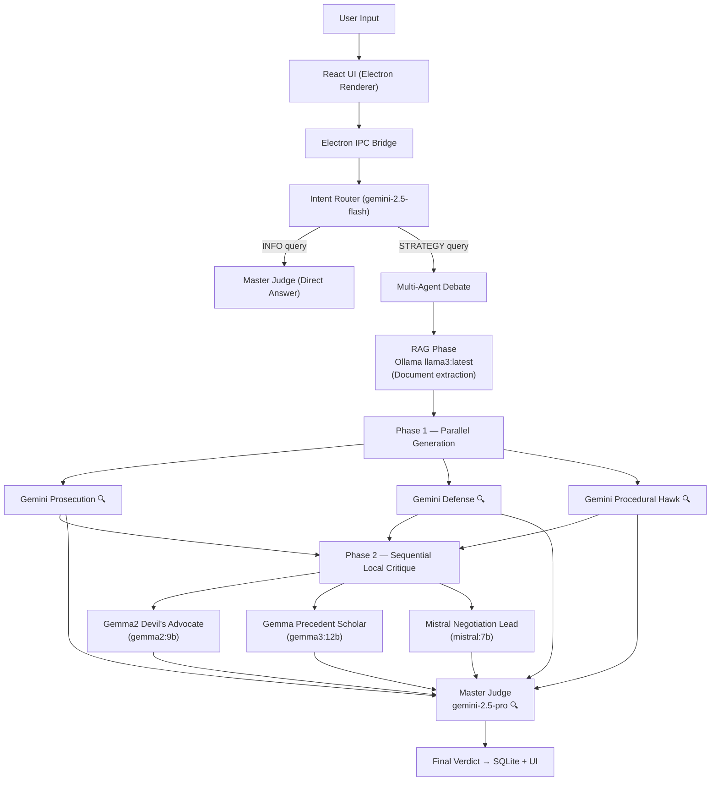
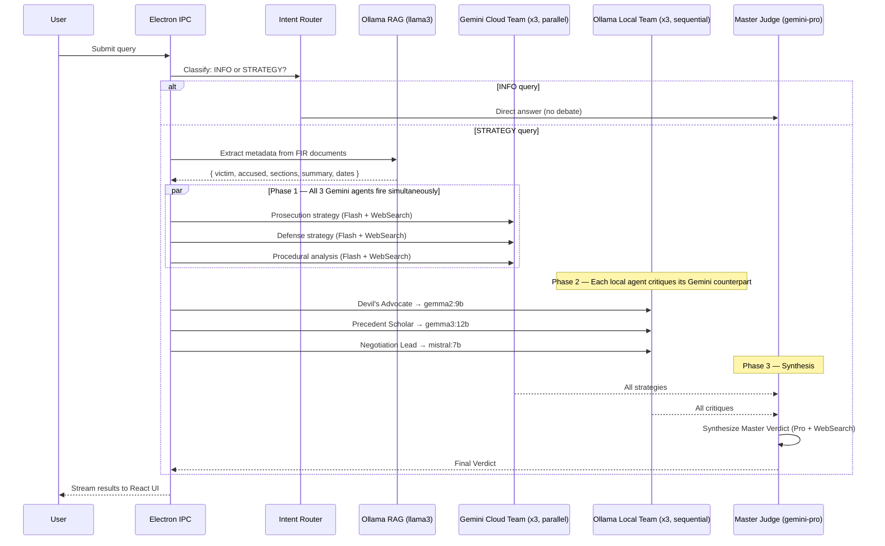

# Legal War Room — System Architecture

> **Hybrid AI Architecture**: Electron + React (Frontend) · Node.js Orchestrator (Backend) · Ollama REST (Local LLMs) · Google Gemini + Web Search (Cloud LLMs)

---

## 1. Architecture Overview

The **Legal War Room** is a multi-agent adversarial debate platform. A cloud Gemini team and a local Ollama team cross-critique each other's legal strategies over real FIR documents. A Master Judge (Gemini Pro + Web Search) synthesizes the debate into a final verdict.

### Component Breakdown

| Layer | Technology | Role |
|-------|-----------|------|
| **Frontend** | React + Electron + React Flow | Split-screen UI, live graph, throttled IPC stream |
| **Orchestrator** | Node.js (`electron/main.cjs`) | IPC handler, intent router, agent coordinator |
| **Cloud Team** | Google Gemini (`@google/genai`) | 3 Flash agents + Master Judge (Pro), all with Google Search |
| **Local Team** | Ollama REST (`localhost:11434`) | 3 local models via `ollama_helper.cjs` |
| **RAG Extraction** | Ollama `llama3:latest` | Parses FIR documents into structured JSON metadata |
| **Data Layer** | SQLite | Persistent chat history and case metadata |

---

## 2. Agent Lineup

| Agent | Model | Location | Web Search |
|-------|-------|----------|-----------|
| Ollama RAG | `llama3:latest` | Local | ❌ |
| Gemini Prosecution | `gemini-2.5-flash` | Cloud | ✅ |
| Gemini Defense Strategist | `gemini-2.5-flash` | Cloud | ✅ |
| Gemini Procedural Hawk | `gemini-2.5-flash` | Cloud | ✅ |
| Gemma2 Devil's Advocate | `gemma2:9b` | Local | ❌ |
| Gemma Precedent Scholar | `gemma3:12b` | Local | ❌ |
| Mistral Negotiation Lead | `mistral:7b` | Local | ❌ |
| **Master Judge** | `gemini-2.5-pro` | Cloud | ✅ |

---

## 3. Data Flow



---

## 4. Execution Sequence



---

## 5. Key File Reference

| File | Purpose |
|------|---------|
| `electron/main.cjs` | Main orchestrator — IPC handlers, agent runners, DB ops |
| `electron/ollama_helper.cjs` | Reusable Ollama REST client (native `http`, no deps) |
| `src/components/DebateArena/DebateArena.jsx` | Persistent React Flow graph with live status indicators |
| `src/components/ChatPanel/ChatPanel.jsx` | Chat UI with markdown rendering |
| `src/components/Sidebar/Sidebar.jsx` | Case history list |
| `src/index.css` | Global styles including `.markdown-body` typography |
| `.env` | `GEMINI_API_KEY` |

---

## 6. Critical Design Decisions

### ESM/CJS Compatibility
`@google/genai` is an ESM-only package. Since `main.cjs` runs in CommonJS mode, it uses a lazy dynamic `import()` wrapper instead of `require()`:
```js
async function getGoogleGenAIClass() {
    if (!_GoogleGenAI) {
        const mod = await import('@google/genai');
        _GoogleGenAI = mod.GoogleGenAI;
    }
    return _GoogleGenAI;
}
```

### IPC Sanitization
All data sent from Electron main → renderer is checked for object types before transmission to prevent React crashes (`Objects are not valid as a React child`). A universal `flatten()` helper ensures all Ollama outputs are strings before any DB save or IPC send.

### Parallel vs Sequential
- **Gemini agents** run in **parallel** via `Promise.all` (fastest path)
- **Local Ollama agents** run **sequentially** (single GPU, shared VRAM — avoids OOM)

### Google Search Integration
All Gemini agents receive `config: { tools: [{ googleSearch: {} }] }` so they autonomously retrieve real Indian case law and statutes during reasoning.

---

## 7. Environment Setup

```bash
# 1. Ensure Ollama is running
ollama serve

# 2. Required Ollama models
ollama pull llama3
ollama pull gemma2:9b
ollama pull gemma3:12b
ollama pull mistral:7b

# 3. Set API key
echo "GEMINI_API_KEY=your_key" > .env

# 4. Install dependencies
npm install

# 5. Start app
npm start
```
